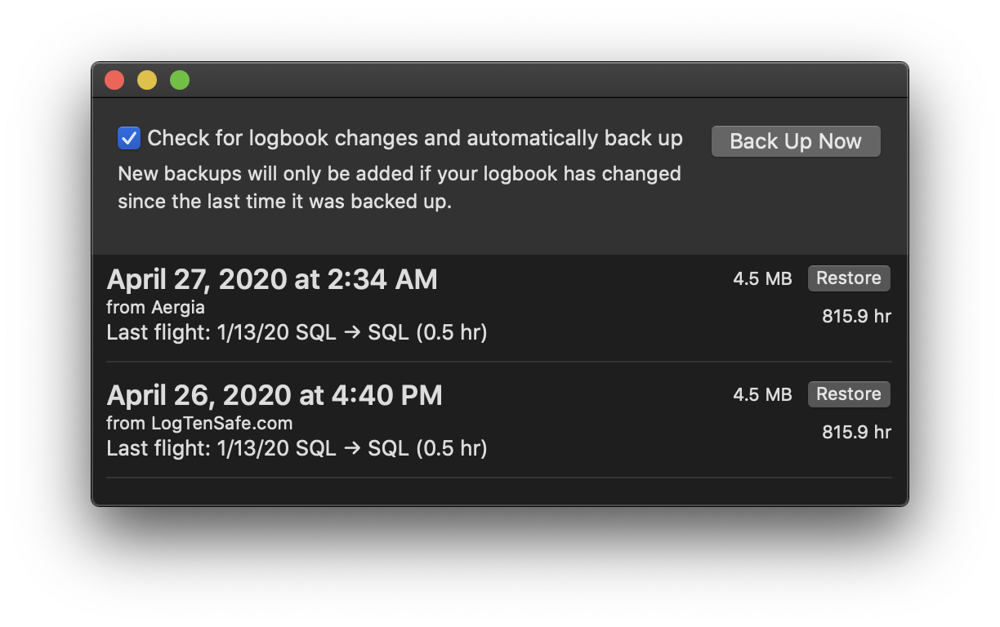
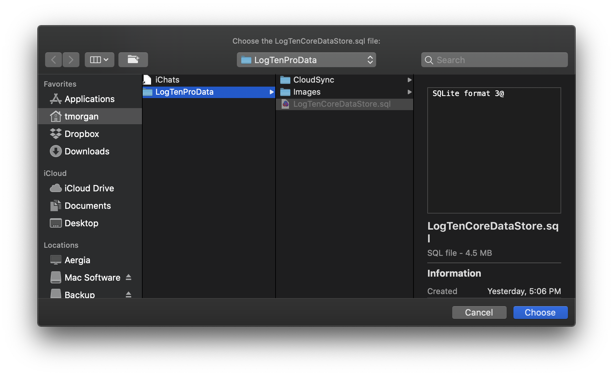

You can back up your logbook at any time by clicking the **Back Up Now** button
on the main window.

The first time you click **Back Up Now**, you will be asked to locate your
logbook, which LogTen Pro saves as a file called `LogTenCoreDataStore.sql`.
Because of macOS security restrictions, LogTenSafe must get your permission to
read this file, which is why it asks you to locate it.

The Open Panel should open right to your logbook location. All you have to do is
confirm that the `LogTenCoreDataStore.sql` file is selected, and press the
**Choose** button.

From then on, when you click **Back Up Now**, your logbook will be uploaded to
LogTenSafe.com without any further steps needed from you. If you have a very
large logbook, the upload may take a period of time. If your logbook has not
changed since your last backup, it will not be uploaded as a duplicate.

Your logbook should appear on the website and on the application shortly after
the upload completes. If it does not, check to make sure that your logbook has
actually changed since the last backup.

- If you want LogTenSafe to automatically back up your logbook regularly, read
  [**Automatically backing up your logbook**](automatic-backups.html).
- If you need to restore a logbook from a backup, read
  [**Restoring from a backup**](restoring.html).
