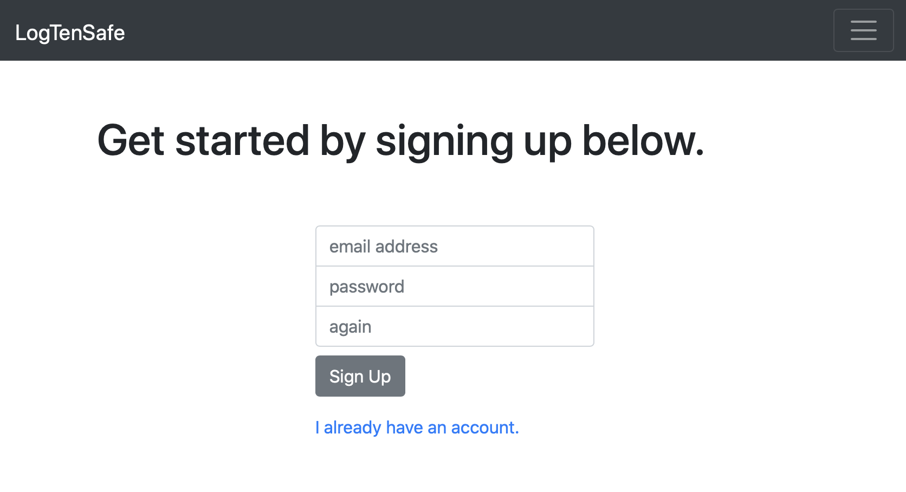
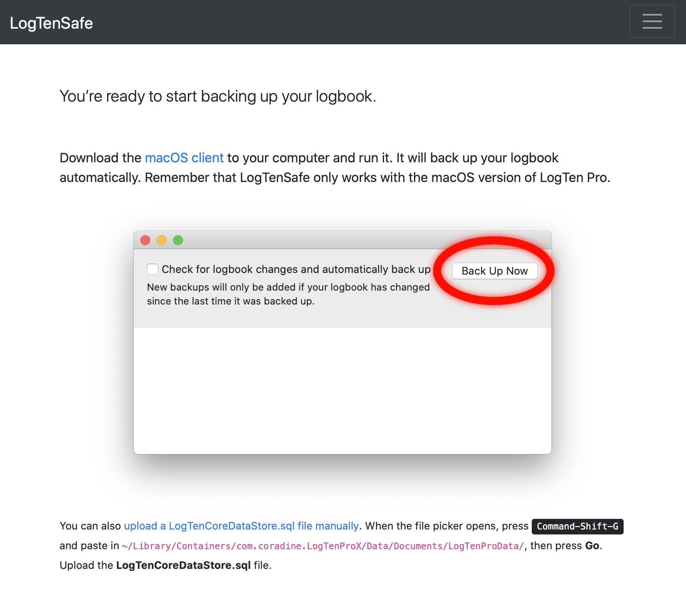
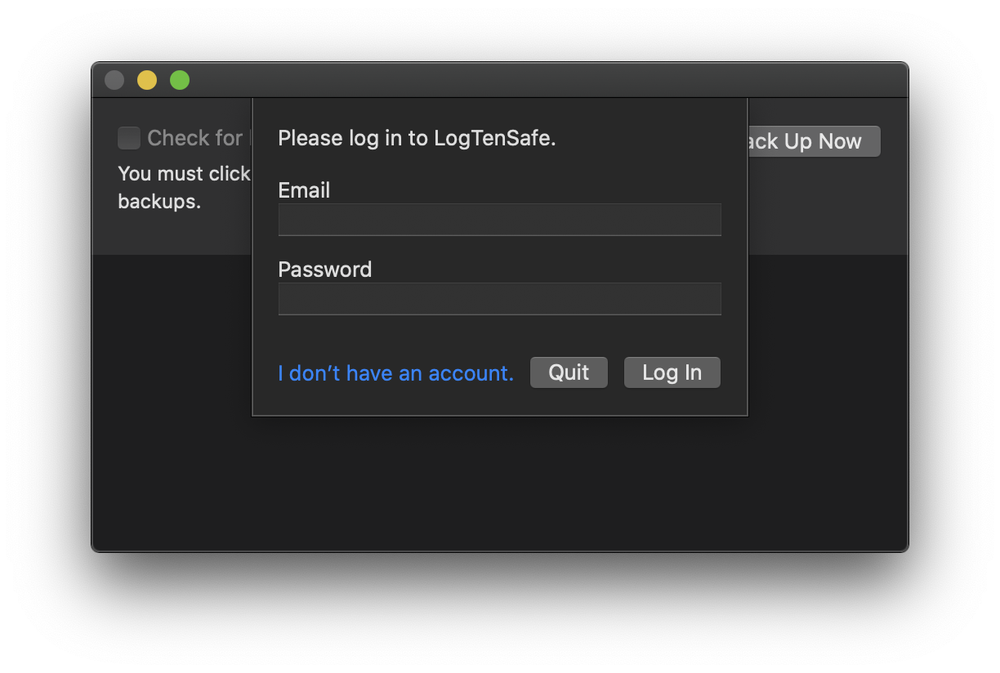

LogTenSafe uploads backups of your logbook to a website, LogTenSafe.com. In
order to use LogTenSafe, you must first create an account on LogTenSafe.com.
Your account protects your logbook, so that no one but you can access it.

To sign up for an account, visit [**www.logtensafe.com**](https://www.logtensafe.com)
in your web browser.

Click the **Get Started** button.

Enter your email address, and choose a password for your account. Your password
must be at least six characters long. Confirm your password by entering it again
in the third text field.

Your email address will only be used to help you recover your account in the
event you lose or forget your password. No other emails are sent.

Once you have signed up, you should see a page similar to this:

You are now ready to sign in to your new account in the LogTenSafe application.
Run LogTenSafe, and when you are presented with the login screen, enter the
email and password for your new account.

* Continue to [**Backing up**](backing-up.html) to back up your logbook.
