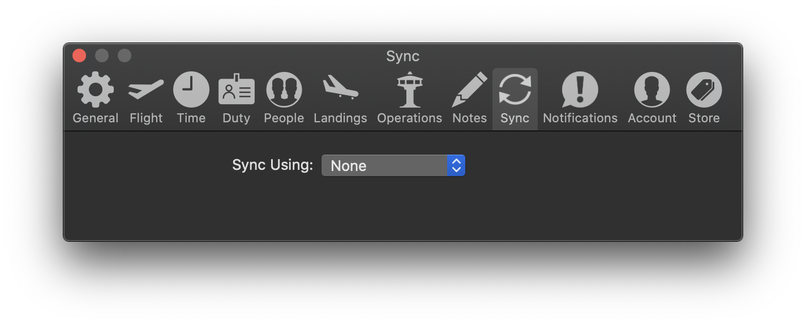
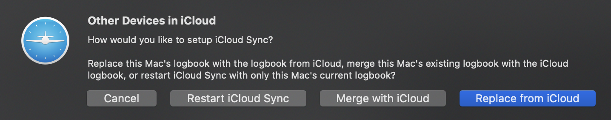

If your logbook becomes damaged, or behind sync, you can restore your logbook
from any of your backups. Before you restore your backup, you should quit
LogTen Pro first if it is running.

Once you are ready, simply press the **Restore** button next to the backup you
wish to restore from.

That backup will be downloaded and placed into the proper location. When you
re-launch LogTen Pro, you should see the restored logbook entries.

## Restoring the logbook to your mobile devices

If you also use LogTen Pro on your iPhone or iPad, you will need to restore the
logbook to your mobile devices.

### Wi-Fi syncing

If you use Wi-Fi syncing, you will need to sync the restored logbook to your
mobile devices using Wi-Fi. Make sure LogTen Pro is open both on your Mac, and
on your iPhone or iPad. You should see your mobile device appear under
**Devices** in LogTen Pro’s sidebar. Click on your mobile device, and press
**Sync** to sync the restored logbook to the device.

### iCloud Sync

If you use iCloud Sync, you may need to restart iCloud sync to see your restored
logbook on your mobile devices. To do this, open LogTen Pro and choose
**Preferences** from the **LogTen Pro** menu. Click the **Sync** tab, and change
the **Sync Using** option from **iCloud** to **None**.

Then, change it from **None** back to **iCloud**. After a short while, you will
be asked how you would like to set up iCloud sync. Choose **Restart iCloud
Sync** to replace the damaged logbook in iCloud with this restored logbook.

